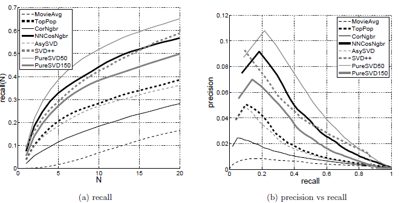

# Crítica de la lectura 3-1: Performance of Recommender Algorithms on Top-N Recommendation Tasks
En este paper, los autores Cremonesi, Koren y Turrin muestran el rendimiento que tienen algunos sistemas recomendadores que había hasta el momento, junto con sistemas elaborados por ellos, para la tarea de hacer recomendaciones top-N. 

### Resumen

Al  comienzo del artículo, se explica que utilizar algoritmos que aprendieron en base a métricas clásicas de error (RMSE, MAE) no obtienen un buen rendimiento para hacer una recomendación top-N. En cambio, las metodologías que utilizan métricas de exactitud (como *recall* y *precision*) pueden generar mejores modelos recomendadores para esta tarea.

Luego, explican la metodología *testing* que utilizaron para probar el desempeño de los modelos. Esta metodología consiste en utilizar sólo valoraciones de 5 estrellas para el set de *test* y crearon un sistema de evaluación que genera las métricas de *recall* y *precision*. También, hablan de que los *datasets* generalmente tiene una *long-tail distribution*, por lo que para realizar experimentos más interesantes, separaron en set de *test* en dos subconjuntos.

Después, hablan sobre los algoritmos de filtros colaborativos más utilizados (kNN y factores latentes) y explican las adaptaciones que le realizaron a cada uno de ellos para tratar de mejorar las recomendaciones top-N.  Estas consisten básicamente en no normalizar la ecuación que utiliza IB-kNN para realizar las recomendaciones y utilizar SVD puro (*PureSVD*) para el caso de la descomposición matricial con factores latentes.

Ya teniendo los modelos definidos, muestran y analizan los resultados que obtuvieron con sus métricas de exactitud para 6 modelos, 2 *datasets* distintos y dos tipos de set de *test*. 

Por último, los autores concluyen que a pesar de hacer un algoritmo sencillo sin basarse en métricas clásicas de errores como el *PureSVD*, este obtuvo un mejor desempeño que los otros algoritmos más sofisticados para recomendaciones top-N.  También, destacan la importancia de haber hecho un set de *test* especializado y dividido en dos subconjuntos que permite evitar sesgos en el desempeño de algunos algoritmos.

### Comentarios

Primero que todo, encontré muy innovador y audaz por parte de los autores el querer utilizar métricas de desempeño distintas a las más comunes como lo son el RMSE y el MAE. Esto generalmente no ocurre, ya que uno está acostumbrado a utilizar estas métricas por su gran popularidad debido al éxito que generalmente tienen y su facilidad de implementación e interpretación. Lo innovador y audaz está en que para un problema que ha sido estudiado por tantos años como lo son estos modelos,  vienen a decir que para la recomendación top-N existe otra manera distinta que sin utilizar el error de medición, pueden obtener mejores desempeños. 

También, es muy interesante y original la metodología que utilizan para realizar el set de *test*, tanto la forma de dividir el *dataset* en dos subconjuntos por la distribución de cola larga, como la selección de sólo valoraciones con 5 estrellas y la forma de calcular las métricas de exactitud.  Nunca había visto un artículo que haga una sección en especial de como armar un set de *test*,  ya que generalmente no le dan tanta importancia y utilizan algún formato estándar para armarlo.

Me gustó cómo adaptaron los modelos clásicos de recomendaciones de forma más simple para especializarlos en generar mejores top-N en vez de enfocarse en disminuir el error clásico. Estas adaptaciones les permitió tener más flexibilidad en los modelos, lo que los llevó a implementar algoritmos sencillos y bastante eficientes. Lo único que no me quedo claro, es cómo entrenaron estos nuevos algoritmos, si dadas las modificaciones que realizaron, no pueden utilizar los métodos de aprendizaje clásicos (como descenso de gradiente), ya que no son basados en métricas de error clásicas.

La estructura general del *paper* la encontré muy buena, ya que estaba muy ordenada, con explicaciones sencillas y con el apoyo adecuado de fórmulas, figuras y subtítulos. Todo esto facilitó mucho la lectura y la comprensión de lo que querían explicar los autores. El único pequeño detalle que no me gustó se explica a continuación:

En esta figura se muestran los resultados de uno de los experimentos que realizaron. A pesar de que están bien hechos y se entienden bien, me hubiera gustado que las líneas de cada algoritmo sean de un color distinto, para facilitar el análisis de los gráficos.

En fin, me pareció un muy buen *paper*, donde explican una idea bastante simple e innovadora, pero que tiene un gran potencial para mejorar la recomendación top-N.