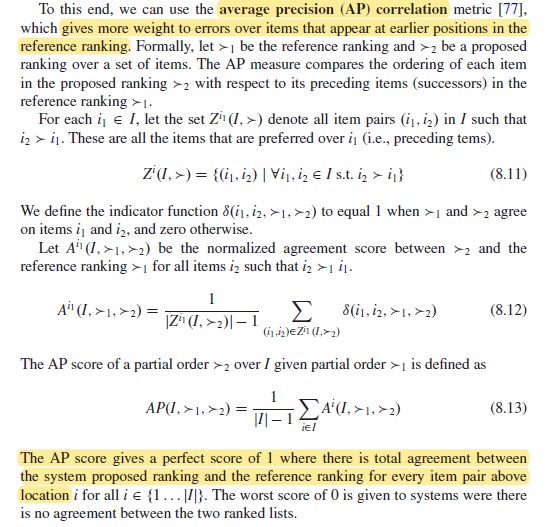

# Crítica de la lectura 3-2: Chapter 8. Evaluationg Recommender Systems (Recommender Systems Handbook)
Este capítulo del libro habla sobre las formas de evaluar los sistemas recomendadores y las propiedades que hay que tener en cuenta para elegir el modelo más adecuado según lo que se necesite.

### Resumen

En un comienzo, se describen y se explican los tres tipos de experimentos que se pueden hacer para evaluar sistemas recomendadores; *offline*, estudios de usuarios y experimentos *online*. 

Luego, nombran y explican las propiedades que tienen estos sistemas, para así  tener mecanismos de comparación al momento de elegir cuál modelo recomendador se adecua más a las necesidades de uno. La primera y una de las más importantes es la **exactitud** de las predicciones, por lo que tiene una explicación mayor que el resto de las propiedades. El restos de propiedades explicadas son:

- ***Coverage***: proporción de datos que el sistema recomienda según todo el *dataset*.
- ***Confidence***: se define como la confianza que tiene el sistema al realizar alguna recomendación/predicción.
- ***Trust***: es similar a la confianza, pero más enfocada en cuánto el usuario confía en las recomendaciones proporcionadas.
- ***Novelty***:  el nivel de recomendaciones novedosas, es decir, ítems que el usuario no conocía.
- ***Serendipity***: es una medida de cuánta sorpresa tienen las recomendaciones exitosas.
- ***Diversity***: es lo opuesto de la similaridad. Es cuán diferentes son las recomendaciones.
- ***Utility***: valor que el sistema o el usuario gana por las recomendaciones.
- ***Risk***: riesgo que tienen las recomendaciones. Se puede medir utilizando la la varianza de la utilidad.
- ***Robustness***: es la estabilidad que tienen el sistema recomendador ante presencia de falsa información y/o a la gran cantidad de solicitudes.
- ***Privacy***: es la privacidad que tienen las preferencias(información) de los usuarios al utilizar estos sistemas.
- ***Adaptivity***: cuántos datos necesita para realizar recomendaciones y cómo actualizarse a medida que llegan nuevos datos.
- ***Scalability***: cómo el sistema responde a aumentar su desempeño al pasar a un *dataset* mucho más grande, tanto en costo computacional, como en tiempo y nivel de recomendación.

### Comentarios

La estructura de este capítulo me pareció muy ordenada, lo que me facilitó la lectura y la comprensión de esta. Además, el hecho de agregar ejemplos en cada sección ayudó a aterrizar y comprender mejor lo que se estaban explicando.

En cuánto al tema explicado, encuentro que las evaluaciones de los sistemas recomendadores son muchas (cómo se pueden ver en el resumen) y esto puede llegar a dificultar la decisión de elegir el mejor modelo para la tarea que se está trabajando. Por esta razón, es muy importante definir cuáles son los objetivos principales del proyecto que se está realizando para enfocarse en las que más propiedades más significativas. No obstante, encuentro que casi sin importar el tipo de tarea, las métricas numéricas de exactitud (*accuracy*) siempre tienen que estar al momento de comparar los modelos. Esto lo digo, porque se ha comprobado empíricamente a lo largo de los años que generalmente los mejores modelo tienen muy buenos *scores* en estas métricas. 

Otro punto importante es elegir que tipo de métrica se quiere para optimizar el rendimiento del modelo, ya que, como se explicó en el capítulo del libro, hay diversas métricas, donde cada una se especializa en medir un tipo de desempeño (ya sea error, precisión, ranking, entre otros). Dado esto, encontré muy bueno esta sección del capítulo, porque explica de forma más profunda y con sus debidas fórmulas cada métrica de desempeño.  Aunque quiero decir que costó seguir algunas de estas por su cantidad de símbolos matemáticos que se usan. Un ejemplo se muestra a continuación:

En este apartado del texto se explica la **métrica de precisión promedio (AP)**, el que a pesar de que está bastante ordenado y con sus respectivas fórmulas, igual me costó entender bien lo que significa y cómo funciona esta. Lo bueno es que en el párrafo final aclara que el mejor valor es 1 y el peor es 0, lo que ayuda a entender mejor esta métrica.

A modo general, me gustó este capítulo del libro, ya que ayuda a ampliar el conocimiento para evaluar modelo, ya sean de recomendación, como de otro rubro. La evaluación es un tema muy importante a la hora de trabajar en un proyecto, porque te permite elegir entre la gran variedad. 

