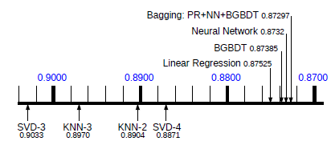

# Crítica de la lectura 5-2: Combining Predictions for Accurate Recommender Systems

En este *paper* del año 2010, los autores austriacos Jaher, Töscher y Legenstein proponen diferentes tipos de ensambles (mezclas) de filtros colaborativos que tienen mejores desempeños que cualquiera  de estos de forma individual.

### Resumen

Para comenzar, se introducen los filtros colaborativos, se describen los principales sistemas que se están utilizando en ese momento, junto con sus desempeños aproximados y tiempos de cómputo. Estos algoritmos son: 

- KNNitem y KNNuser
- SVD, SVDe y AFM (*asymetric factor model*)
- RBM (*restricted Botzman machines*)
- GB (*global effects*)

Luego, habla de *combinar* estos algoritmos para poder mejorar el *accuracy*, que en este caso es el RMSE. Para esto, utilizó el entrenamiento residual, que básicamente es entrenar los modelos de forma secuencial con los errores del modelo anterior.

Una vez teniendo las mejores 18 combinaciones de estos métodos, los autores proponen distintas formas de mezclar estas combinaciones para mejorar aún más el desempeño. Las formas de ensambles que describen son:

- *Linear regression* (LR)
- *Binned linear regression* (BLR)
- *Neural Network* (NN)
- *Bagged Gradient Boosted Decision Tree* (BGBDT)
- *Kernel Ridge Regression Blending* (KRR)
- *K-Nearest Neighbors Blending* (KNN)

Después, realizan experimentos de los ensambles enunciados anteriormente con el *dataset* del *Netflix prize*, el que separan el set de *train* en una parte para entrenar los modelos individuales, y otras dos (de menor tamaño) para entrenar y testear las mezclas de algoritmos. Los resultados de estos experimentos tuvieron mejor desempeño que todos los algoritmos de forma individual, pero además probaron con una mezcla de ensambles  (PR-NN-BGBDT) que tuvo el mejor desempeño.

Por último, concluyen con que el mejor desempeño fue la combinación de ensambles, pero que para *datasets* de gran escala, conviene utilizar el ensamble de redes neuronales, ya que su rendimiento es muy similar, pero su costo computacional de predicción es mucho menor.

### Comentarios

Primero que todo, el hecho de utilizar bastantes tablas y gráficos para mostrar los resultados ayudó mucho a entender y ver mejor lo que querían explicar los autores de manera sencilla. También, el hecho de explicar cada método de forma breve y simple, hizo la lectura más fácil de entender. En especial, me gustó mucho la última figura del *paper* que es:

Esta figura muestra de forma bien elegante y clara los resultados finales que tuvieron con los experimentos realizados. De esta manera, se respalda y se ve la relevancia que tiene los sistemas de ensambles para mejorar el desempeño de recomendación, que era el objetivo principal de los autores con este *paper*.

Aprovechado esta imagen, encuentro que los ensambles de modelos son armas de doble filo. Por un lado, el hecho de combinar varios modelos te ayuda a captar mucha información del *dataset* de distintas formas, lo que, como se ve en la figura, mejora el desempeño del modelo. Sin embargo, por el otro lado tenemos que el modelo de ensamble se complica cada vez más cuando se le agrega un nuevo algoritmo, lo que conlleva a una mayor costo computacional y a una menor interpretación y explicación de los resultados que se están obteniendo (ya que al ser una mezcla, no se puede saber cómo el algoritmo recomienda). Por esta razón, yo opino que los ensambles es una buena manera de aumentar el rendimiento de un modelo, pero hay que hacer un *trade-off* entre el desempeño y la complejidad de este. Como ejemplo, en este *paper* se realiza al final el ensamble de ensambles, que obtiene el mejor rendimiento, pero viendo nuevamente la figura, el modelo neuronal tiene un resultado muy similar, pero una velocidad de predicción mucho mayor a este, lo que lo hace preferible a gran escala.

Otra cosa que me llamó la atención, es el gran rendimiento que tiene la red neuronal. A pesar de que existen varios métodos más complejos tanto de teoría, como de implementación y costo computacional, este modelo pudo ser capaz de tener el mejor rendimiento de ensamble individual y sin perder velocidad en la predicción. Yo generalmente había visto el gran desempeño de las NN en otro tipo de áreas cómo es la clasificación o modelamientos de sistemas físicos, donde se tiene muchos datos para entrenar. Por esta razón, en verdad no me extraña que tuviera tan buen desempeño para el área de recomendación, ya que estos modelos se entrenan con millones de datos, lo que es el escenario perfecto para las redes neuronales. Con esto, me confirma una vez más que este tipo de modelo cada vez es más útil en el mundo actual y que va a ir mejorando por el hecho del aumento de información, lo que las hacer ser muy potentes para el futuro cercano.

Para terminar, encontré este *paper* habla sobre varios tipos de ensambles de algoritmos recomendadores, el que se respalda con mucha información experimental que se resumió bien con tablas y gráficos, lo que te ayuda a ver las ventajas y desventajas que tienen estos tipos de modelos.

