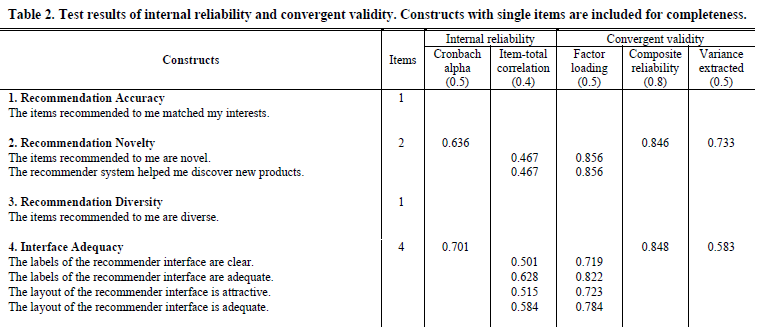

# Crítica de la lectura 8-1: A User-Centric Evaluation Framework for Recommender
Systems

En este *paper*, los autores proponen un *framework* completo que permite evaluar la experiencia de los usuarios con los sistemas recomendadores. Este sistema se llama **ResQue** y consiste en 32 preguntas y 15 constructos que permiten evaluar las cualidades esenciales para tener un efectivo y satisfactorio sistema recomendador.

### Resumen

Hasta el momento, la investigación de los sistemas recomendadores se ha focalizado principalmente en optimizar algoritmos en base a métricas de desempeño, como lo es el *accuracy*. Sin embargo, investigadores más recientes han estudiado que la satisfacción del usuario no siempre está correlacionada con recomendadores con buena exactitud.

Dicho esto, se presenta un *framework* unificado llamado **ResQue**, que se basa en principios de modelos de evaluación de uso como lo son TAM y SUMI. Este modelo contiene 15 constructos y comenzó con 43 preguntas. Además, se construyó un set de hipótesis que relacionan los distinos constructos.  Este se puede describir con las siguientes cuatro capas:

- *Perceived System Qualities*: Esta capa se puede dividir en 4 secciones que son. Primero está la **calidad de recomendación**, que consiste en medir cuan buena son las recomendaciones con métricas subjetivas de exactitud, novedad, atractivo y diversidad. Segundo está la **adecuación de la interfaz**, que se preocupa de como la interfaz del sistema recomendador logra la máxima claridad y visibilidad de sus recomendaciones. Tercero es la **adecuación de interacción** y cuarto está la **suficiencia de información y explicabilidad**.
- *User beliefs*: Esta capa ce preocupa de cuan efectivo y eficiente es el sistema para ayudar a cumplir los objetivos del usuario. Se puede separar en tres partes. La **utilidad percibida**, la **facilidad de uso percibida** y el **control y transparencia**.
- *Attitudes*: La actitud es el sentimiento generalizado que tiene el usuario hacia el sistema recomendador. Una de las características más importantes es medir la confianza que tiene el usuario hacia el sistema.
- *Behavioral Intentions*: Se trata de si el sistema es capaz de influenciar las decisiones del usuario para que este elija algún ítem de las recomendaciones realizadas.

Con este set de hipótesis se procedió a validar el modelo, con un experimento que contribuyeron principalmente estudiantes de Europa  y Asia, donde se evaluaron distintas plataformas con sistemas recomendadores como lo son Amazon y Youtube. Con este experimento se pudo probar la validez y fiabilidad de las estructuras del modelo, lo que permite ser utilizado para evaluar los sistemas recomendadores. 

Con esto, se puede concluir que se implementó un modelo que con 15 criterios definen las cualidades esenciales de un sistema recomendador efectivo y satisfactorio para el usuario.

### Comentario

Encuentro muy importante el punto que se toca en este *paper* que es el de enfocarse en la evaluación del sistema recomendador según la percepción del usuario. Generalmente, cuando uno hace un sistema recomendador se focaliza en obtener las mejores métricas de desempeño, pero no hay que olvidar que el objetivo final de este es generar una herramienta que va a utilizar un usuario, y como lo que se dice en este *paper*, no necesariamente mayor exactitud significa un mejor sistema recomendador para el usuario.

El modelo que proponen parece muy completo y obtuvo un buen resultado en el experimento realizado. Sin embargo, me parece que este tiene que seguir probándose en otros rubros y tipos de usuarios para ver su real potencial y utilidad para la evaluación de sistemas recomendadores. Además, a pesar de que explican detalladamente cada área del *framework* realizado, no se me hizo fácil la comprensión de este  y hay cosas que sigo teniendo dudas. Esto se puede deber principalmente a que no es de mi gran interés este tipo de *paper*, en donde se habla de temas psicológicos y subjetivos más que ecuaciones y algoritmos numéricos. Por ejemplo, una de las cosas que costó comprender y que estuve harto tiempo tratando de entender es la tabla 2 que presentaron. Un parte de esta se muestra a continuación:

A pesar de que está bien organizada la tabla con cada constructo y sus preguntas relacionadas, los números de la parte derecha estuvo harto tiempo tratando de entenderlos, ya que no era fácil de analizarlos.

Quiero concluir que el modelo de evaluación presentado en este artículo se ve muy potente y robusto para utilizarlo como mecanismo de evaluación de sistemas recomendadores y da una solución en un tema que no está tan bien investigado por los académicos del área, lo que lo hace bien interesante y novedoso. Sin embargo, ya que no es tema de mi preferencia, se me hizo pesada la lectura y me costó entender algunas definiciones que escribieron los autores.

