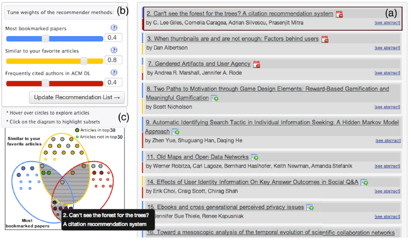

# Crítica de la lectura 8-2: See What You Want to See: Visual User-Driven Approach for Hybrid Recommendation
Este *paper* escrito por los autores D. Parra, P. Brusilovsky y C. Trattner el año 2014, trata sobre la implementación de una interfaz gráfica de sistemas recomendadores híbridos en donde el usuario puede controlar la importancia de cada modelo para generar sus recomendaciones.

### Resumen

En un comienzo, los autores hablan de que generalmente las investigaciones de sistemas recomendadores se focalizan en mejorar la exactitud que tienen los algoritmos para predecir recomendaciones. En cambio, otro área que no se ha investigado tanto, y es de gran importancia, es la interacción de computador-humano (*Human-Computer Interaction, HCI*).  Esta tiene principalmente tres características: *transparency*, *explainability* y *controllability*, donde los autores se van a enfocar principalmente en la última.

Luego, se resume brevemente dos líneas de investigación relacionadas al tema que son *Visual Approaches for Recommendations* y *Recommender systems for Research Talks or Articles*.

Después, presentan su interfaz de recomendación híbrida con *sliders* y diagramas de Venn, para que los usuarios puedan controlar sus recomendaciones y explican sus funcionalidades, apoyadas con imágenes de la interfaz. También, hacen una breve explicación de los modelos de recomendación del sistema híbrido que utiliza la interfaz.

Una vez explicada esta interfaz, se analizan los estudios realizados, comparando los resultados obtenidos en dos conferencias del año 2013. Estos consistían en entregar esta interfaz a los participantes de estas conferencias y recolectar la información de las interacciones de los usuarios con esta.

Por último, se concluye que la interfaz creada permite hacer el proceso de fusión de los sistemas híbridos de una manera más transparente, explorable y controlable. Además, que los estudios permitieron demostrar que esta generó un mayor impacto en la motivación, desempeño y actitud del usuario en comparación con un interfaz que muestra sólo la lista de las recomendaciones.

### Comentarios

Primero que nada, encuentro muy interesante este tema, ya que generalmente uno está acostumbrado a optimizar el desempeño con métricas numéricas y se olvida que estos sistemas van dirigidos a un usuario. Es más, si el sistema recomendador es muy bueno (según métricas), pero no tiene una interfaz adecuada para el usuario, no se va a cumplir el objetivo principal, que es recomendar. Por esta razón, encontré muy bueno el enfoque que le dieron en este *paper*, que es acerca de la interfaz de usuario más que de los algoritmos recomendadores.

También, encontré que se explicó muy bien y de forma detallada la interfaz propuesta, lo que ayudó a comprender mejor los resultados y la relevancia de este *paper*. Uno de los aspectos que aportaron bastante para esta explicación fueron las imágenes de la interfaz que colocaron en el documento. Una de esas es la siguiente:

En esta figura se puede ver claramente la estructura de la interfaz y sus funcionalidades, lo que ayuda a comprender mejor como funciona esta y el impacto que puede causar para los sistemas recomendadores.

A pesar de que explicaron los estudios realizados de esta interfaz en dos conferencias, no me quedó del todo claro cuáles eran las diferencias entre las dos interfaces, lo que no me permitió ver el gran impacto de los resultados obtenidos. También, me hubiera gustado que dentro de una misma conferencia, se hubiesen presentado ambas interfaces, pero a distintas personas, para tener una comparación con la misma población. Esto lo digo, ya que a pesar de que ambas conferencias era de área de RecSys, hay diferencias de contexto (ej. temporal) que pueden afectar a la evaluación de la interfaz.

A modo de conclusión, este *paper* es muy interesante por el hecho de tocar un tema tan relevante para los RecSys, pero que no se han realizado tantos estudios. Además, generaron una interfaz bastante amigable que permite controlar y tener una explicación de las recomendaciones obtenidas, lo que le da una ventaja al sistema recomendador. No obstante, este ha sido sólo un estudio, por lo que me gustaría ver más pruebas en otro tipo de datos y perfiles de usuarios distintos, para ver el potencial que tiene este tipo de interfaz.

